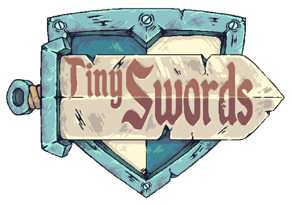

  

The game called Tiny Swords is just for learning Flame.

  
  
  
  
  

---

# Resources

## Images

[Tiny swords](https://pixelfrog-assets.itch.io/tiny-swords)

# App

## Renamed

| Android | iOS | Linux | macOS | Web | Windows |
| :-----: | :-: | :---: | :---: | :-: | :-----: |
|   ✅    | ✅  |  ✅   |  ✅   | ✅  |   ✅    |

## Launcher icons updated

| Android | iOS | Linux | macOS | Web | Windows |
| :-----: | :-: | :---: | :---: | :-: | :-----: |
|   ✅    | ✅  |  ✅   |  ✅   | ✅  |   ✅    |
